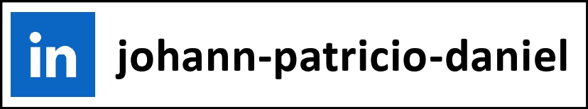

  

✅ Apaixonado por tecnologia e acima de tudo por buscar conhecimento.

✅ Faço parte da 19ª edição do programa de formação Starter web fullstack developer da Growdev.

  

  

### Técnologias que estou estou estudando atualmente:

  

  

  

  

  
  
  
  
  
  
  
  
  

<h2>Contato:</h2>

  

  

